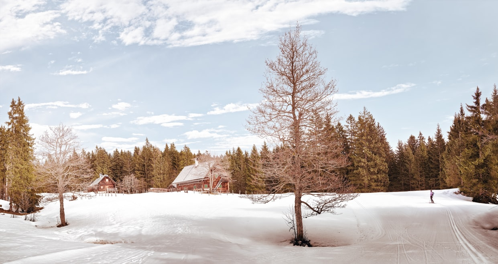
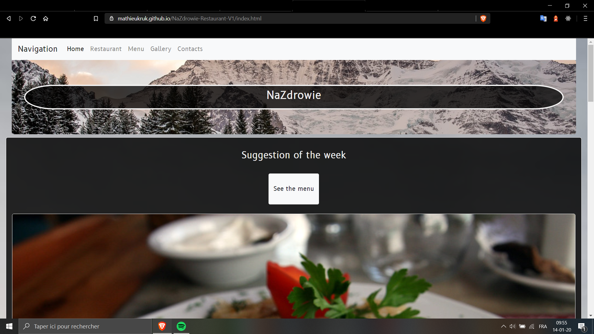

# 🍽️ Na Zdrowie Restaurant V1 

## ◾ Features

<ul>
  <li>Na Zdrowie is a static website made for a fictional restaurant.</li>
  <li>It tries to provide a better visibility and increase the reastauran's communication.</li>
</ul>

<hr>

<p align="center">
  
</p>

<hr>

## ◾ Motivation

It has been launch the 💠10/09/2019💠 in the case of a school project (<a href="https://github.com/becodeorg" target="_blank">BeCode</a>).

Below, you will find our guidelines hosted on the school repo: 
▪️▪️▪️▪️▪️▪️▪️▪️▪️▪️▪️▪️▪️▪️▪️▪️▪️▪️▪️▪️▪️▪️▪️▪️▪️▪️▪️▪️▪️▪️▪️▪️▪️▪️▪️▪️▪️▪️▪️▪️▪️▪️▪️▪️▪️▪️▪️▪️▪️▪️▪️▪️▪️▪️▪️▪️▪️▪️▪️▪️▪️▪️▪️▪️▪️▪️▪️▪️▪️▪️▪️▪️▪️▪️▪️▪️▪️▪️▪️▪️▪️▪️▪️▪️▪️▪️▪️▪️▪️▪️▪️▪️▪️▪️▪️▪️▪️▪️▪️▪️▪️▪️▪️▪️▪️▪️▪️▪️▪️▪️▪️▪️▪️▪️▪️▪️▪️▪️▪️▪️▪️▪️▪️▪️▪️▪️▪️

Type of challenge: *consolidation* +
Repository: *restaurant-css-framework* +
Duration: *4 day* +
Deadline: Tuesday September 10th 2019 - 17:00 +
Form: https://forms.gle/kK7v6Mwg7bpJMcXD6 +
Team challenge: *solo*


== Missions objectives

At the end of this challenge you should have improved your:

* placement of element with *Bootstrap*


== The mission

Create a repository called _restaurant-css-framework_ in which you must realise
a window web page for a restaurant. The franchise is fictive, but the type of
food (burger, pizza, asian, ...) is your choice.

The website must be *responsive*, at least for small and medium screens. It must
at least have five accessible pages: welcome, menu, pictures, restaurants and
contact.

.Welcome
A page with one _Jumbotron_ and two panels to show news (promo, events, etc...).

.Menu
A page with the restaurant menu in the form of a grouped list with badges.

.Pictures
A page with a gallery of minimum 10 pictures and a pagination (3 photos per
page).

.Restaurant
A page about the restaurants (it's a franchise) with its addresses, a map, and
different schedules.

.Contact
A page with a contact form containing the firstname, lastname, email, subject of
the message (a drop-down list with multiple options), an area for the message
itself and a send button with an icon. Each entry as a title in a semantically
correct tag.

If you want to make an even more complex website feel free to try new things and
make it as beautiful as possible.

=== Instructions
* create the repository
* write a good *README*
* don't use a pre-made theme
* mention a description and the website URL on the top of the repo
* use ONLY royalty-free pictures AND credit in your readme the website where the pictures are from

=== Advices

. Read the instructions well.
. Take time to prepare (prototype, content, pictures, ...).
. Go step by step, *HTML*, then *classes* and *id* and finally *CSS*.

=== Optional

* use *SASS*

=== Resources

* https://tinyurl.com/y2nlxere[README]
* http://glyphicons.com/[glyphicons]

▪️▪️▪️▪️▪️▪️▪️▪️▪️▪️▪️▪️▪️▪️▪️▪️▪️▪️▪️▪️▪️▪️▪️▪️▪️▪️▪️▪️▪️▪️▪️▪️▪️▪️▪️▪️▪️▪️▪️▪️▪️▪️▪️▪️▪️▪️▪️▪️▪️▪️▪️▪️▪️▪️▪️▪️▪️▪️▪️▪️▪️▪️▪️▪️▪️▪️▪️▪️▪️▪️▪️▪️▪️▪️▪️▪️▪️▪️▪️▪️▪️▪️▪️▪️▪️▪️▪️▪️▪️▪️▪️▪️▪️▪️▪️▪️▪️▪️▪️▪️▪️▪️▪️▪️▪️▪️▪️▪️▪️▪️▪️▪️▪️▪️▪️▪️▪️▪️▪️▪️▪️▪️▪️▪️▪️▪️▪️

<hr>

## ◾ Tasks

- [x] Initialize the ReadMe and the trello.
- [x] First static version of the website.
- [x] Website design.
- [x] Launch the website.

ℹ️ For further informations, please make sure to visit my **Trello** [board](https://trello.com/b/wkDPM6CS/na-zdrowie-restaurant) (only in french).

<hr>

## ◾ Build status

📲 V2.0.1
Logs
   - First design version.
   - All pages finished.
   - ...

<hr>

## ◾ Screenshots

### Homepage
<p align="center">
  
</p>

<hr>

## ◾ Tech/framework used

1. Front-end
   - [HTML](https://www.w3.org/html/)
   - [Sass](https://sass-lang.com/)
   - [Bootstrap](https://getbootstrap.com/)
   - [Font Awesome 4.7](https://fontawesome.com/v4.7.0/)

<hr>

## ◾ Code Example

### List of menus:
```
<!-- Menus list -->
<div class="menu row text-center border border-white rounded-lg">
 <div class="col-12">
  <h4>Menus of the month:</h4>
   <ul class="list-group">
    <li class="list-group-item d-flex justify-content-between align-items-center">
     <h6>Żurek & Pierogi ruskie</h6>
     <span class="badge badge-primary badge-pill">12 €</span>
    </li>
    <li class="list-group-item d-flex justify-content-between align-items-center">
     <h6>Zupa ogórkowa & Bigos</h6>
     <span class="badge badge-primary badge-pill">10 €</span>
    </li>
    <li class="list-group-item d-flex justify-content-between align-items-center">
     <h6>Barszcz czerwony & Schabowy z ziemniakami i kapustą</h6>
     <span class="badge badge-primary badge-pill">12 €</span>
    </li>
    <li class="list-group-item d-flex justify-content-between align-items-center">
     <h6>Rosół & Chleb ze smalcem</h6>
     <span class="badge badge-primary badge-pill">8 €</span>
    </li>
  </ul>		
 </div>
</div>
```

<hr>

## ◾ Credits

[Mathieu Kruk](https://github.com/MathieuKruk)

## ◾ License

OpenSource | Free

<hr>

<p align="right">
 ✍️ Readme Author:
  <br>
  <a href="https://github.com/MathieuKruk">Mathieu Kruk</a>
</p>

<p align="right">
  
</p>
